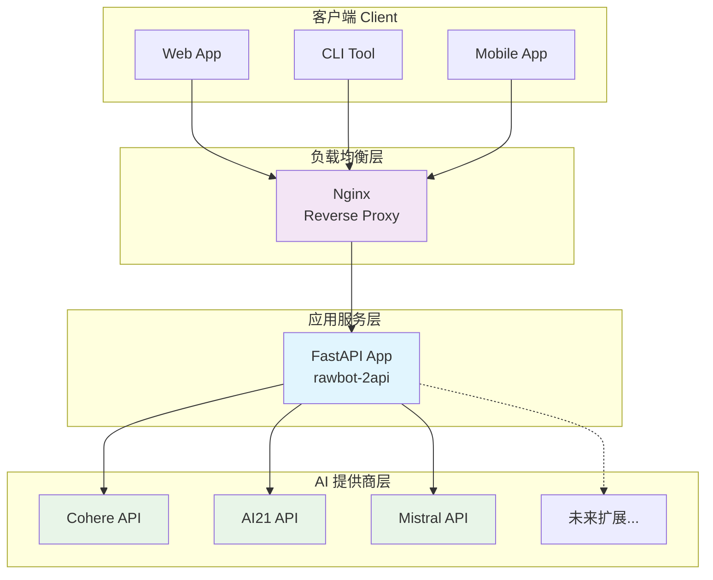
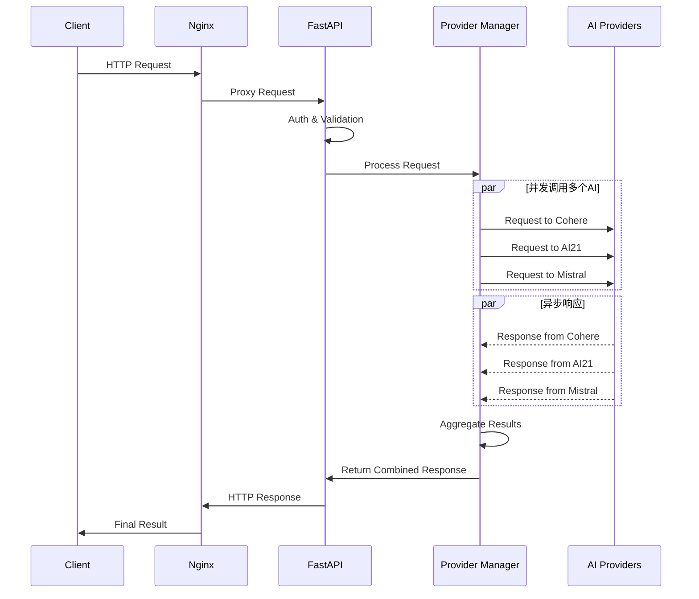
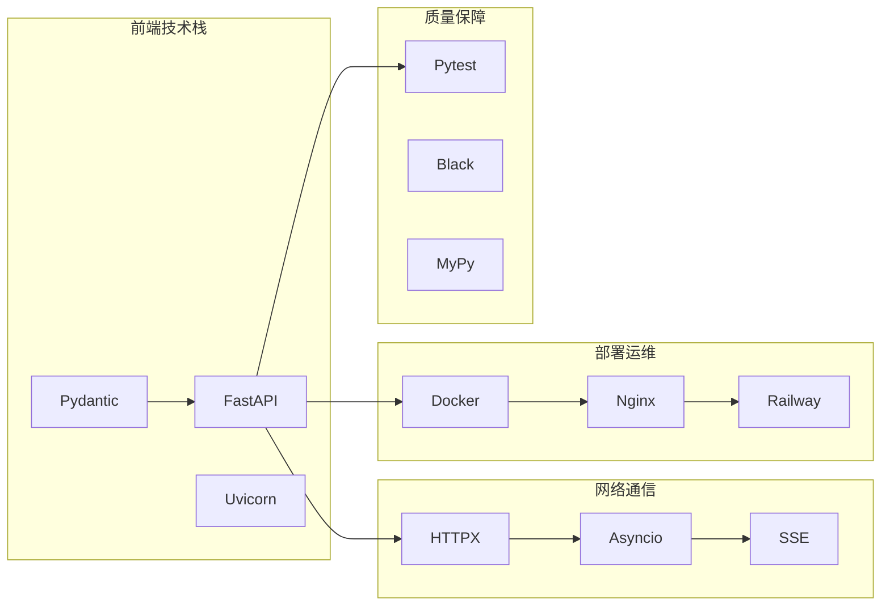
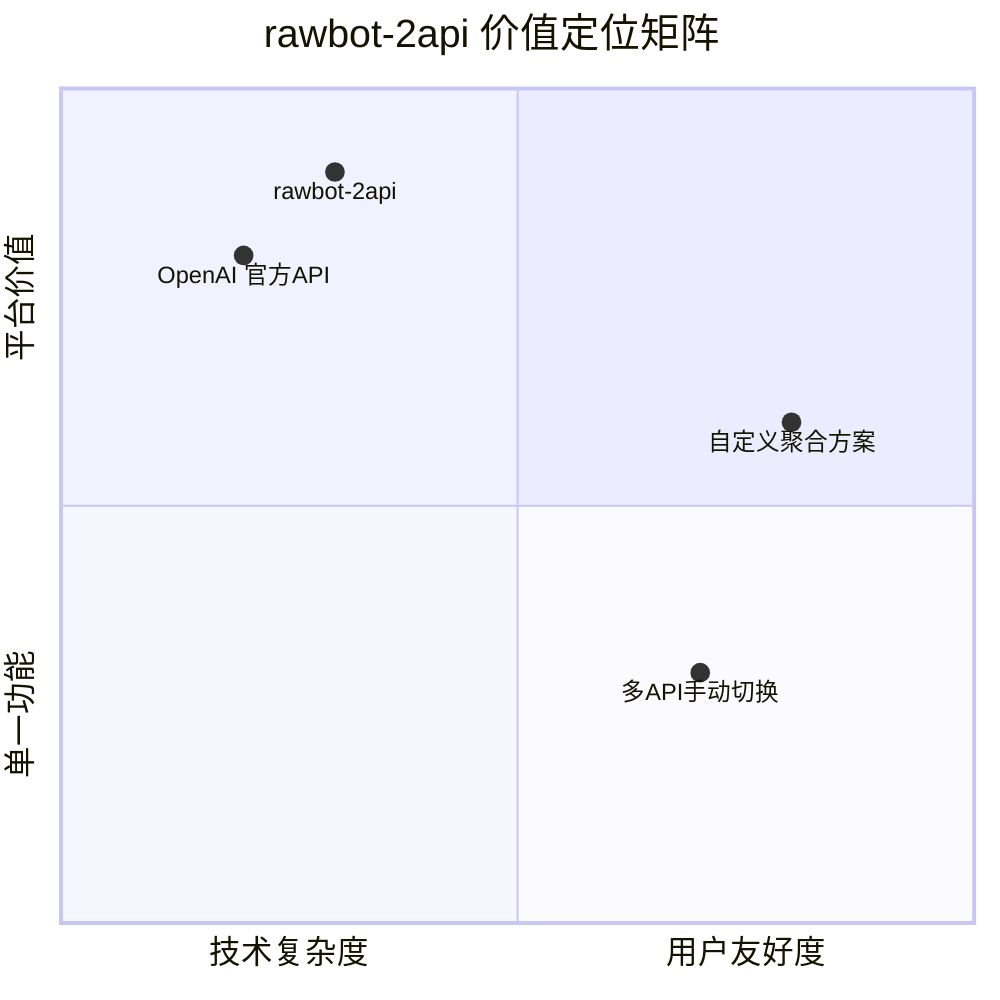
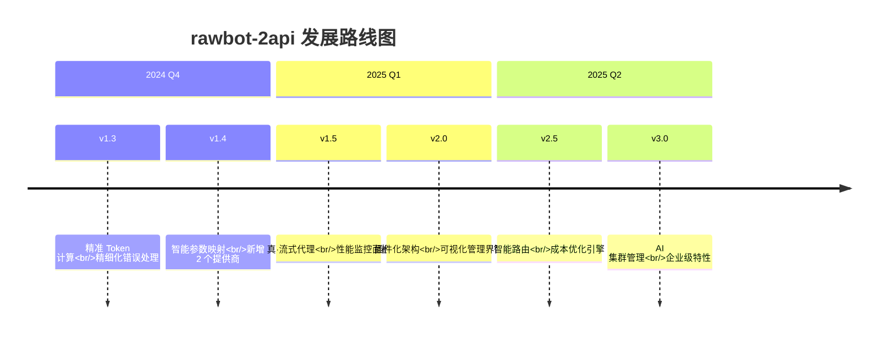

# rawbot-2api: 你的私人AI模型"交响乐团" 🎶

[](https://opensource.org/licenses/Apache-2.0)
[](https://github.com/lzA6/rawbot-2api)
[](https://www.python.org/)
[](https://www.docker.com/)

> "我们不是在编写代码，我们是在指挥一场由 0 和 1 组成的交响乐。每一个函数调用，都是一次音符的跳动；每一次成功响应，都是一曲华美的乐章。"

欢迎来到 `rawbot-2api` 的世界！这是一个充满魔力的项目，它能将多个不同厂商的 AI 模型（如 Cohere, AI21, Mistral）聚合起来，像一位才华横溢的指挥家，让它们为你同时"演奏"，最终汇成一曲独一无二的答案。

最重要的是，它将这一切复杂性隐藏在一个简洁、统一、与 OpenAI API 格式兼容的接口背后。这意味着，你可以用最小的改动，让原本只支持 OpenAI 的应用，瞬间拥有"三头六臂"！

---

## 🎯 快速导航

- [✨ 一键部署](#-一键部署--快速开始)
- [🏗️ 系统架构](#️-系统架构深入解析)
- [🧠 核心原理](#-核心原理与设计哲学)
- [🛠️ 技术深度解析](#️-技术点深度解析极客狂欢时间)
- [🚀 未来蓝图](#-未来蓝图从现在到卓越)
- [🤝 如何贡献](#-如何贡献)

---

## ✨ 一、懒人福音：一键部署 & 快速开始

我们深知，对于一个探索者而言，最宝贵的是时间。所以，我们为你准备了"瞬间移动"般的部署体验。

### 🚀 选项一：一键部署到云端 (推荐)

[](https://railway.app/new?template=https%3A%2F%2Fgithub.com%2FlzA6%2Frawbot-2api)
[](https://vercel.com/new/clone?repository-url=https%3A%2F%2Fgithub.com%2FlzA6%2Frawbot-2api)

**部署步骤：**
1. 点击上面的部署按钮
2. 使用你的 GitHub 账号登录
3. 在项目设置的 "Variables" 中填入必要的环境变量
4. 部署完成！获得你的专属 URL

### 🐳 选项二：本地 Docker 部署

```bash
# 1. 克隆项目
git clone https://github.com/lzA6/rawbot-2api.git
cd rawbot-2api

# 2. 配置环境变量
cp .env.example .env
# 编辑 .env 文件，填入你的 API 密钥

# 3. 启动服务
docker-compose up -d --build
```

### 🎮 快速测试

```bash
curl -X POST http://localhost:8090/v1/chat/completions \
  -H "Content-Type: application/json" \
  -H "Authorization: Bearer your-master-key" \
  -d '{
    "model": "rawbot-omnibus",
    "messages": [
      {"role": "user", "content": "请用三种不同的风格介绍你自己"}
    ],
    "stream": false
  }'
```

---

## 🏗️ 二、系统架构深入解析

### 架构总览



### 🔄 请求处理流程



### 📁 项目结构详解

```
🎻 rawbot-2api/
├── 🐳 容器化配置
│   ├── Dockerfile              # Python 应用容器配置
│   ├── docker-compose.yml      # 多服务编排
│   └── nginx.conf             # 反向代理配置
├── 🔧 核心应用
│   ├── main.py                # FastAPI 应用入口
│   ├── requirements.txt       # Python 依赖
│   └── app/
│       ├── core/
│       │   ├── config.py      # 配置管理 (Pydantic)
│       │   └── security.py    # 认证中间件
│       ├── providers/
│       │   ├── base_provider.py    # 抽象基类
│       │   ├── rawbot_provider.py  # 核心聚合逻辑
│       │   └── cohere_provider.py  # Cohere 适配器
│       ├── routes/
│       │   ├── chat.py        # 聊天端点
│       │   └── models.py      # 模型列表端点
│       └── utils/
│           └── sse_utils.py   # 流式响应工具
├── 🔐 环境配置
│   ├── .env.example          # 环境变量模板
│   └── .env                  # 你的专属配置 (本地)
└── 📚 文档
    ├── README.md             # 项目文档
    └── ARCHITECTURE.md       # 架构说明
```

---

## 🧠 三、核心原理与设计哲学

### 1. 🎪 扇出聚合模式 (Fan-Out & Aggregation)

**工作原理：**
- **扇出 (Fan-Out):** 接收单个请求，并发调用多个 AI 服务
- **聚合 (Aggregation):** 收集所有响应，智能组合成统一格式
- **伪流式 (Pseudo-Streaming):** 模拟实时打字效果，优化用户体验

**代码实现：**
```python
async def process_request(self, messages: List[Message]) -> str:
    # 并发调用所有提供商
    tasks = [
        self._call_cohere(messages),
        self._call_ai21(messages), 
        self._call_mistral(messages)
    ]
    
    # 等待所有响应
    results = await asyncio.gather(*tasks, return_exceptions=True)
    
    # 聚合结果
    return self._aggregate_responses(results)
```

### 2. 🎯 设计原则

| 原则 | 说明 | 收益 |
|------|------|------|
| **OpenAI 兼容性** | 完全模拟 OpenAI API 格式 | 无缝集成现有生态 |
| **无状态设计** | 不保存会话状态 | 易于水平扩展 |
| **配置驱动** | 环境变量管理所有配置 | 安全且灵活 |
| **异步优先** | 全链路异步处理 | 高并发高性能 |

---

## 🛠️ 四、技术点深度解析（极客狂欢时间！）

### 技术栈全景图



### 🔧 核心技术详解

| 技术 | 应用场景 | 难度 | 创新潜力 |
|------|----------|------|----------|
| **FastAPI** | API 服务器框架 | ⭐⭐☆☆☆ | 自动文档生成，类型安全 |
| **Asyncio** | 并发请求处理 | ⭐⭐⭐☆☆ | 真正的异步流式处理 |
| **HTTPX** | HTTP 客户端 | ⭐⭐⭐☆☆ | 支持 HTTP/2，连接池 |
| **Pydantic** | 数据验证 | ⭐⭐☆☆☆ | 运行时类型检查 |
| **Docker** | 容器化部署 | ⭐⭐⭐☆☆ | 微服务架构准备 |

### 🚀 性能优化特性

1. **连接复用**: 使用 HTTPX 连接池减少 TCP 握手开销
2. **请求超时**: 为每个提供商设置独立超时，避免级联失败
3. **错误隔离**: 单个提供商失败不影响其他服务
4. **内存优化**: 流式处理大响应，避免内存溢出

---

## 📊 五、项目价值与优势

### 🎁 核心价值矩阵



### ✨ 核心优势

| 优势 | 说明 | 用户价值 |
|------|------|----------|
| **🎯 一站式集成** | 统一多个 AI 服务接口 | 减少 80% 的集成工作量 |
| **🚀 即插即用** | OpenAI 兼容的 API | 零成本迁移现有应用 |
| **💡 智慧聚合** | 多模型回答对比 | 获得更全面的见解 |
| **🛡️ 高可用** | 故障隔离设计 | 服务稳定性提升 |
| **🎓 学习典范** | 现代 Python 最佳实践 | 优质的学习参考项目 |

### ⚠️ 当前限制

| 限制 | 现状 | 改进计划 |
|------|------|----------|
| 伪流式响应 | 先聚合再流式 | 升级真流式 (v1.5) |
| Token 计算 | 暂不准确 | 精确统计 (v1.3) |
| 参数统一 | 基础参数支持 | 高级参数映射 (v1.4) |
| 错误处理 | 基础错误信息 | 精细化错误码 (v1.3) |

---

## 🗺️ 六、未来蓝图：从现在到卓越

### 🎯 版本路线图



### 🚀 近期计划 (v1.3 - v1.5)

- [ ] **真·流式代理**: 实时合并多个 AI 流式响应
- [ ] **精准 Token 计算**: 跨提供商 Token 统计
- [ ] **提供商插件系统**: 动态加载新 AI 服务
- [ ] **健康检查**: 自动检测提供商状态
- [ ] **速率限制**: 智能限流保护

### 🌟 远期愿景 (v2.0+)

- [ ] **🖥️ 可视化仪表盘**: Web 界面管理所有配置
- [ ] **🧠 智能路由**: 基于成本/速度/质量的自动选择
- [ ] **🔌 插件生态**: 社区贡献的提供商插件
- [ ] **🏠 本地模型**: Ollama, llama.cpp 集成
- [ ] **📊 数据分析**: 使用统计和性能洞察

---

## 🤝 七、如何贡献

### 🎉 欢迎贡献！

我们相信每个人的微小贡献，汇聚起来足以改变世界。无论你的技能水平如何，都可以为项目添砖加瓦。

### 🛠️ 贡献方式

| 贡献类型 | 技能要求 | 影响程度 |
|----------|----------|----------|
| **🐛 报告 Bug** | 基础使用 | ⭐⭐☆☆☆ |
| **📝 改进文档** | 写作能力 | ⭐⭐⭐☆☆ |
| **💡 新功能建议** | 产品思维 | ⭐⭐⭐☆☆ |
| **🔧 代码贡献** | Python 技能 | ⭐⭐⭐⭐☆ |
| **🎨 界面设计** | UI/UX 设计 | ⭐⭐⭐⭐☆ |

### 🚀 快速开始贡献

1. **Fork** 本仓库
2. 创建功能分支: `git checkout -b feature/amazing-feature`
3. 提交更改: `git commit -m 'Add amazing feature'`
4. 推送分支: `git push origin feature/amazing-feature`
5. 创建 **Pull Request**

### 🎯 好的第一个 Issue

我们标记了 [`good first issue`](https://github.com/lzA6/rawbot-2api/labels/good%20first%20issue) 标签，帮助新贡献者快速上手！

---

## 🎊 结语

`rawbot-2api` 不仅仅是一个工具，它是我们对 AI 未来的一种想象——一个开放、互联、智能的 AI 生态系统。每一行代码，每一次提交，都是向着这个愿景迈出的一步。

**现在就加入我们，一起打造下一代 AI 基础设施！** 🚀

---

<div align="center">

**如果这个项目对你有帮助，请给我们一个 ⭐ 星星支持！**

[](https://star-history.com/#lzA6/rawbot-2api&Date)

</div>

---

> **致未来的开发者**: 这个项目展示了现代 Python 异步编程、API 设计、容器化部署的最佳实践。无论你是学习、使用还是贡献，都希望你在这个过程中有所收获。记住，最好的代码是能够激发灵感的代码！ ✨
